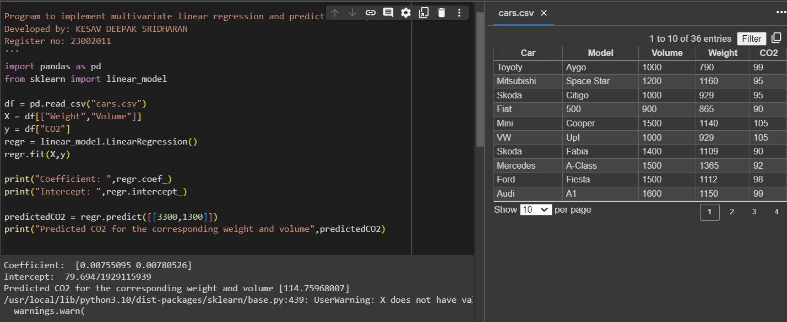

# Implementation of Multivariate Linear Regression
## Aim
To write a python program to implement multivariate linear regression and predict the output.
## Equipment’s required:
1.	Hardware – PCs
2.	Anaconda – Python 3.7 Installation / Moodle-Code Runner
## Algorithm:
### Step1:
Importing pandas and scikit-learn libraries.
### Step2:
Reading the data from a CSV file.
### Step3:
Splitting the data into features (X) and target (y).
### Step4:
Creating and fitting the linear regression model.
### Step5:
Printing the coefficients and intercept of the linear regression model.
### Step6:
Making a prediction.
### Step7:
Printing the predicted CO2 emissions.
## Program:
```python
'''
Program to implement multivariate linear regression and predict the output
Developed by: KESAV DEEPAK SRIDHARAN
Register no: 23002011
'''
import pandas as pd
from sklearn import linear_model

df = pd.read_csv("cars.csv")
X = df[["Weight","Volume"]]
y = df["CO2"]
regr = linear_model.LinearRegression()
regr.fit(X,y)

print("Coefficient: ",regr.coef_)
print("Intercept: ",regr.intercept_)

predictedCO2 = regr.predict([[3300,1300]])
print("Predicted CO2 for the corresponding weight and volume",predictedCO2)
```
## Output:

## Result
Thus the multivariate linear regression is implemented and predicted the output using python program.